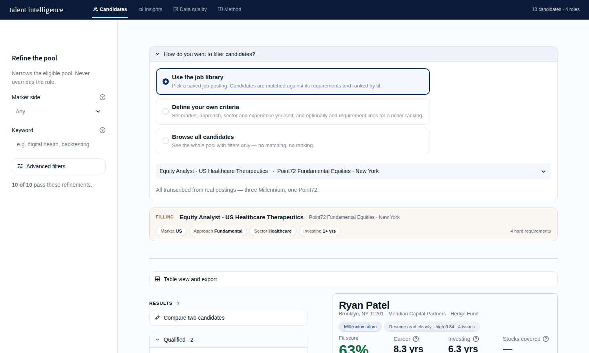
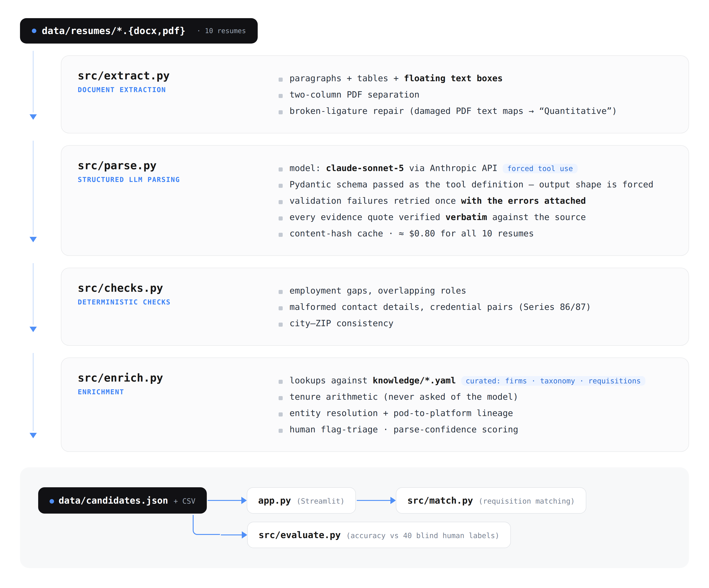

# Talent Intelligence Platform

Ten messy resumes in, a defensible shortlist out. A junior-analyst
sourcing tool for a hedge fund Business Development team: LLM-parsed
records with verbatim evidence behind every claim, matched against real
job requisitions — by a search that is allowed to say **"no one
qualifies."**

**Live app:** https://m-case-study-jasmine.streamlit.app/
**Walk-through notebook:** [`Yuanzhi_Jasmine_Chen_Talent_Intelligence_Platform.ipynb`](Yuanzhi_Jasmine_Chen_Talent_Intelligence_Platform.ipynb)



---

## Three product claims

**1 · The matching is reliable enough to act on.** Hard requirements
disqualify (region, approach, experience band — a candidate outside them
is not an 82% match, they are not a match); soft signals rank the
survivors, with the weights in YAML where they can be argued about.
Which is which follows how recruiting actually works, and the scoring
respects junior-analyst hiring specifically: demonstrated skills,
credentials and education carry weight, while self-reported AUM and
returns — the currency of senior hiring — are displayed with their
quotes and never scored. Against one real Mumbai posting, nobody in this
pool qualifies, and the app says exactly that, names each near miss's
single gap, and computes what widening would admit.

**2 · The parsing reads the pile the way a careful screener would — and
proves it.** Every classification carries the resume sentence that
produced it, verified to appear verbatim in the source. The checks a
human runs first on a finance resume — employment gaps, overlapping
dates, malformed contact details, credential inconsistencies — are
computed automatically and flagged, with a human triage layer deciding
which are real risks and which are benign conventions. Accuracy is
measured, not assumed: 40 blind human labels, **precision 100%, recall
57%** — and all three misses trace to a single experience-band rule,
which turned out to be the most interesting finding in the project.

**3 · The interface is built for the BD workflow, not for a demo.**
Fine-grained dimensions zoned with tags (tags may carry colour;
coloured text may not — one of ~15 review rounds' worth of rules), a
21-column table view with CSV export, one-click outreach drafts that
quote the resume, pool-level insight charts whose empty cells are the
point, and working previews of the roadmap: a retrieval-based Ask tab
and a talent network drawn from a curated firm knowledge base.

---

## Quick start

```bash
pip install -r requirements.txt
streamlit run app.py
```

That runs the app against the committed dataset. No API key is needed — the
app calls no model.

To rebuild the dataset from raw resumes:

```bash
pip install -r requirements-dev.txt
cp .env.example .env          # add your ANTHROPIC_API_KEY
# place resumes in data/resumes/
python src/build_dataset.py
```

Parsing 10 resumes costs roughly $0.75 and is cached, so re-running after a
knowledge-base or enrichment change costs nothing.

---

## Pipeline



Parsing is schema-constrained extraction against `claude-sonnet-5` via
the Anthropic API: the Pydantic schema is passed as a tool definition
with forced tool choice, validation failures are retried once with the
errors attached, and every evidence quote is verified verbatim against
the source text.

### Extraction does more work than it looks like

The largest source of error in a resume pipeline is not the model — it is
losing content before the model ever sees it. `python-docx` reads neither
tables nor floating text boxes, and both carry real content here:

| Document | Naive paragraph extraction | This pipeline |
|---|---:|---:|
| `Viktor_Sharat.docx` | 503 chars | 3,100 chars |
| `Zara_AlRashid.docx` | 2,848 chars | 3,401 chars |

One resume keeps its candidate name, degree and section heading inside text
boxes. Read without them the document appears to have no name and an
unlabelled work-history table — and every conclusion drawn from that
appearance is wrong. Two-column PDFs are split before reading, and broken
ligatures (`Quan?ta?ve` → `Quantitative`) are repaired, with anything
unrecoverable reported rather than guessed.

### The model is asked only for judgement

Anything code can settle is settled by code. Tenure is date arithmetic. A
firm's type is a lookup. A region is a lookup. Narrowing the model's remit
shrinks the surface where it can be wrong and makes a wrong answer a one-line
fix in a YAML file rather than a prompt experiment.

| Asked of the model | Computed in code |
|---|---|
| Fundamental vs systematic, with evidence | Years of experience |
| Which sectors, with evidence | Firm type, parent platform, region |
| Whether a role was an investment role | Seniority band |
| Contradictions and misattributions in the text | Employment gaps and overlaps |

### The knowledge base supplies what no model knows

`knowledge/` holds curated domain facts a language model cannot be trusted to
supply, and does not signal when it is guessing:

- **firms.yaml** — that North53 Capital is a Millennium pod, that Cinctive is
  a multi-manager platform, that ICICI Securities is Indian sell-side. Pod
  lineage is why the app can surface *"previously at Millennium"* for a
  candidate whose resume names only the pod.
- **taxonomy.yaml** — region mapping, sector aliases, seniority bands,
  credential glossary (`Series 7` → *General Securities Representative*),
  software normalisation (`Bloomberg Terminal` and `Bloomberg` are one tool).
- **requisitions.yaml** — job requisitions with their hard and soft criteria,
  plus the concept map used for requirement matching.

Firm matching refuses to guess. This corpus contains four unrelated firms
whose names begin with "Meridian"; substring matching would silently relocate
a candidate to the wrong continent, so a name that matches several entries is
reported ambiguous rather than resolved.

---

## Requisition matching

Four requisitions ship with the app — three Millennium postings (REQ-27950,
REQ-25042, REQ-29449) and one Point72 posting — all transcribed from real
postings rather than written to fit the data. That matters: a requisition
invented alongside the scoring logic can only confirm itself.

Against the Mumbai posting's 4–5 year requirement, **no candidate in this
pool qualifies** — the three APAC fundamental analysts are all far too
senior. The app reports that plainly, lists the near misses, names the single
constraint each one failed, and computes what widening each requirement
would admit.

Similarity between a requirement and a candidate's experience uses a pluggable
backend (`src/match.py`). The default combines lexical overlap with a curated
concept map, because this domain runs on paraphrase — a requisition says
"catalysts" where a resume says "earnings events". Neural sentence embeddings
would absorb that automatically and can be dropped in unchanged; at a few
hundred candidate sentences a curated map performs comparably, adds no large
dependency to a free-tier deployment, and is auditable — a bad match is fixed
by editing a line of YAML.

---

## Repository layout

```
app.py                     Streamlit application
src/extract.py             document → clean text + extraction diagnostics
src/schema.py              Pydantic schema; the LLM's output contract
src/parse.py               schema-constrained extraction with retry
src/checks.py              deterministic gap / overlap / contact checks
src/knowledge_base.py      entity resolution and domain lookups
src/enrich.py              extraction + knowledge base → Candidate
src/build_dataset.py       pipeline entry point
src/match.py               requisition matching
src/evaluate.py            accuracy against blind human labels
src/glossary.py            every on-screen field's definition
knowledge/*.yaml           curated domain facts
data/candidates.json       parsed dataset (what the app loads)
data/candidates.csv        flat export for spreadsheet review
data/extraction_log.csv    per-document extraction diagnostics
data/ground_truth.csv      40 blind human labels for evaluation
tests/test_pipeline.py     11 regression tests (no API key needed)
tools/build_notebook.py    regenerates the walk-through notebook
tools/build_review_page.py side-by-side page used for manual verification
```

Raw resumes and the case brief are deliberately not committed; the parsed
dataset is.

---

## Known limitations

- **Ten candidates.** Several design choices (a curated concept map rather
  than embeddings, in-memory filtering rather than an index) are correct at
  this scale and wrong at a hundred thousand. The thresholds where each should
  change are noted in the relevant module.
- **The concept map generalises only as far as it is curated.** It handles the
  paraphrases in this domain that were written into it.
- **Parse confidence describes the document, not the candidate.** Formatting
  carries zero weight in the score, because how neatly a resume is formatted
  tracks regional convention and native language far more than it tracks the
  person.
- **Synthetic corpus.** The resumes are fictional, supplied with the case
  study. Firms marked `source: inferred` in `firms.yaml` were classified from
  resume context rather than external knowledge.
